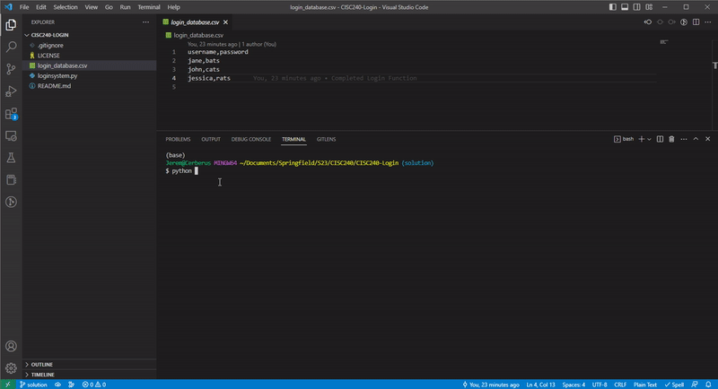

# Instructions  

This HW is focused on creating a login system. There will be a file called `login_database.csv` that is a CSV file of all the usernames and passwords in our database. Here is an excerpt of the starting database:

```txt
username,password
jane,bats
john,cats
jessica,rats
```

Here we can see that we have three users in the database. We can **read** this CSV file as a list of dictionaries by using the following code:

```python
with open("login_database.csv", 'r') as f
    list_of_users = list(DictReader(f))
```

`list_of_users` now is a list of dictionaries. You can now loop through every user like you would any other list. 

**Your objective** is to create a program that allows users to: 
1. Login to the system using their credentials (they will enter their username and password). You will check if its valid.
3. Register a new login (user will create a user name and password)
3. Quit. The program save the any newly registered users into `login_database.csv` before quitting.


## Expected Steps and Requirements (10 pts)

1. Create a function called `read_database()`. It should read the file `login_database.csv` as a list of dictionaries (see above) and return it. (2 pts)
2. Create a function called `login(list_of_users)`. It should ask the user for the username and then the password. If the username and password exist in the database return True, else return False. (2 pts)
3. Create a function called `register(list_of_users)`. It should ask the user for a username and password. You should then create a dictionary of this new username and password and `append` to `list_of_users`. (2 pts)
3. Create a function called `write_database(list_of_users)`. It should **overwrite** the existing `login_database.csv` file with `list_of_users`. Please see the [documentation](https://docs.python.org/3/library/csv.html#csv.DictWriter) (2pt)
    1. HINT - Open the file like this, `with open(DATABASE_FILE, 'w', newline='') as f:`
4. Finish the remaining conditional statements in the `main` function while loop. You should check the command name and then call the respective functions (2 pts)
5. No syntax or run time errors (1 pt)
6. Modify the `register` function such that you can **not** have duplicate user names (1pt).


**Example Output**

This the running program in VSCodes terminal. If you don't have VSCode setup to use GitBash, you will use Windows Terminal.




